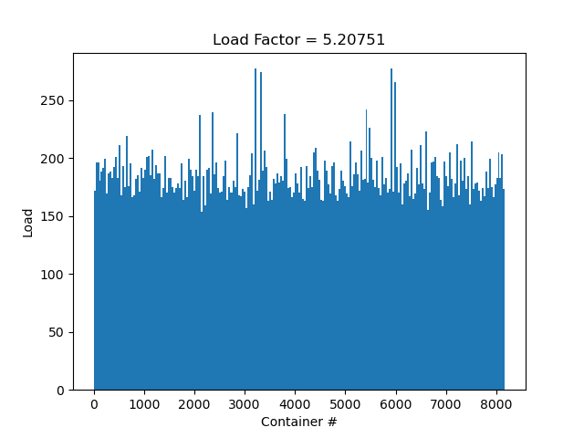

# HashTable
Моя реализация хэш-таблицы. Ключи - слова на английском языке,
а значения - количество их встреч в тексте.

## Система
- **CPU** Intel Core i5 1135G7
- **OS** Arch Linux x86_64 6.8.5-zen1-1-zen
- **RAM** 8GB 3200 Mhz
- **Compiler** gcc 13.2.1

## Исследование загруженности таблицы

### ZeroHash


### FirstChar


### LengthHash


### SumLengthHash


### SumHash


### Murmur2AHash


### CRC32


## Тесты 0 итерация
Containers Count = 5113
|Zero|Length|FirtChar|SumLength|Sum|MurMur|CRC32|
|-----------|-----------|-----------|-----------|-----------|-----------|-----------|
|$1.053*10^{11}$|$1.061*10^{10}$|$2.458*10^{9}$|$4.878E*10^{9}$|$5.490*10^{8}$|$5.396*10^{8}$|$4.924*10^{8}$|

## Оптимизация

Нужно решить, какую хэш-функцию использовать далее, для этого посмотрим, какой хэш
успешно скейлится. Увеличим в $\approx 2$ количество контейнеров. Поулчилось, что
MurMurHash оказался лучшим. Оставим только его, и поставим также O3. Протестим!
Это будет нашей "базой".


| Оптимизация       | Тики             | Ускорение относительно "базы" | Относительное ускорение |
|-------------------|------------------|-------------------------------|-------------------------|
| O3                | $3.294 * 10^{8}$ | 1                             | 1                       |

Видно, что сейчас большую процессорного времени занимает strcmp, перепишем его, используя интринсики.

```c++
bool StrcmpAVX512(const char* s1, const char* s2)
{
    __m512i s1_intr = _mm512_load_epi64(s1);
    __m512i s2_intr = _mm512_load_epi64(s2);
    __mmask64 cmp   = _mm512_cmp_epi8_mask(s1_intr, s2_intr, _MM_CMPINT_EQ);
    return cmp == (~(uint64_t)0);
}
```


| Оптимизация       | Тики             | Ускорение относительно "базы" | Относительное ускорение |
|-------------------|------------------|-------------------------------|-------------------------|
| O3 StrCmpAVX512   | $2.909 * 10^{8}$ | 1.13                          | 1.13                    |

