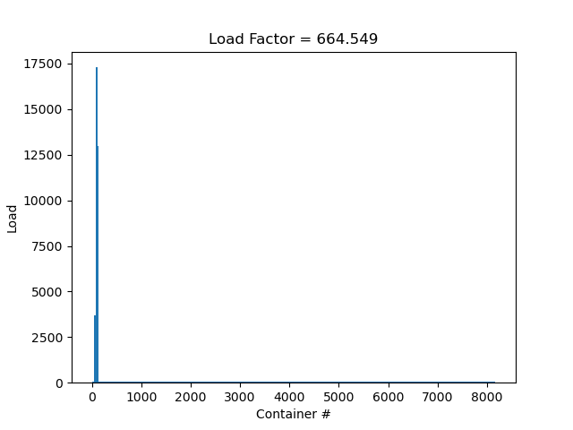
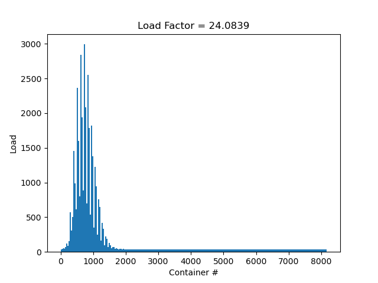

# HashTable
Моя реализация хэш-таблицы. Ключи - слова на английском языке,
а значения - количество их встреч в тексте.

## Исследование загруженности таблицы

### ZeroHash

### FirstChar

### LengthHash

### SumLengthHash

### SumHash

### Murmur2AHash

## Оптимизация

| Уровень оптимизации | Количество тактов | Относительно предыдщуего |
|---------------------|-------------------|--------------------------|
| -O0                 | 